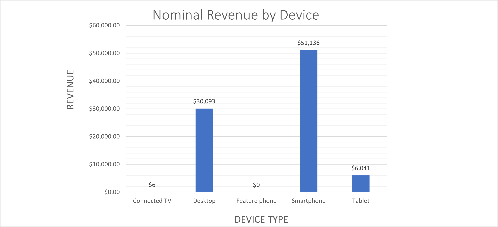

# Ad Performance & Revenue Analytics

This repository contains an end-to-end analysis of advertising performance data for a digital media and publishing company. The objective is to reveal which ad formats, channels, and sites deliver the greatest revenue, identify delivery gaps, and recommend budget shifts that improve return on spend.

---

## 1. Project Goals

| # | Objective | Outcome |
|---|-----------|---------|
| 1 | Prepare a clean, analysis-ready dataset | `data/ad_performance_clean.xlsx` |
| 2 | Explore revenue and delivery patterns by site, device, and ad unit | SQL queries and Excel pivots |
| 3 | Visualise key findings for executives | Three charts in `/visuals` |
| 4 | Produce a rolling seven-day revenue view for weekly dashboards | Query Q4 in `sql/ad_performance_analysis.sql` |
| 5 | Summarise insights and recommended actions | `docs/executive_summary.pdf` |

---

## 2. Data and Methods

| Step | Description | Tool |
|------|-------------|------|
| Extraction | Raw impression and billing exports | SQLite |
| Cleaning | Site abbreviation parsing, lookup join, error removal | SQLite, Excel |
| Analysis | Pivot tables, custom KPIs (CPM, fill rate) | Excel |
| Reproducibility | Parameterised SQL scripts | SQLite compatible |
| Visualisation | Revenue and trend charts | Excel PNG export |

> **Production note**  
> In a warehouse environment (for example Snowflake or BigQuery) the inline `site_lookup` table in Q4 would be replaced by a join to the permanent site dimension. The lookup creation statements remain in the script, so the project runs immediately in SQLite.

---

## 3. Repository Structure
ad-performance-revenue-analytics/
│
├── data/                    
│   ├── raw_data.xlsx
│   └── ad_performance_clean.xlsx
│
├── workbooks/            
│   └── site_performance_pivots.xlsx
├── sql/                   
│   └── ad_performance_analysis.sql
│
├── visuals/                 
│   ├── revenue_by_device.png
│   ├── impressions_mix_by_day.png
│   └── cpm_trend.png
│
├── docs/                    
│   └── executive_summary.pdf
│
├── README.md
├── LICENSE                   
└── .gitignore               

---

## 4. Key Insights

* **Top-grossing sites**  
  WarHistoryOnline generated CA$31.3 k for the month, equal to 36% of total revenue, and CA $8.0 k in the last seven days. TheVintageNews (CA $21.1 k, 24%) and Iwastesomuchtime (CA $17.1 k, 21%) complete the lead group.

* **Device mix**  
  Smartphones account for 59% of revenue (CA$51.1k). Desktop follows at 35% (CA$30.1k). Tablets and connected TVs are niche, feature phones are negligible.

* **CPM leaderboard**  
  Highest average CPMs belong to ManmadeDIY (CA $1.62), SlowRobot (CA$ 1.46), and Decoist (CA$ 1.46). The lowest CPMs sit with IloveWWIIPlanes (CA $0.27) and WarHistoryOnline (CA $0.55).

* **Fill-rate outliers**  
  WarHistoryOnline, ManmadeDIY, and TheVintageNews all exceed 98% fill. TankRoar trails at 63% and IloveWWIIPlanes at 77%.

* **Momentum check – last seven days**  
  Revenue share stayed concentrated in the same three lead properties. No emerging site showed breakout growth.

---

## 5. Recommendations

1. **Lift CPM on War History Online**  
   High traffic and 98% fill allow a measured floor-price increase or richer creative without volume loss.

2. **Rebalance mobile video budget**  
   Mobile video consumes 35% of spend yet returns only 19% of revenue. Shift 10 - 15% toward high-CPM desktop static ads.

3. **Fix Tank Roar delivery issues**  
   A 63% fill rate points to blocked tags or misconfigured demand. An ad-ops audit can reclaim lost impressions.

4. **Expand high-CPM niche sites**  
   ManmadeDIY and Slow Robot offer CPMs above CA $1.40. Even modest impression growth will add outsized revenue.

5. **Automate the rolling seven-day query**  
   Schedule the last-seven-days revenue view to refresh each morning so executives see trend shifts in real time.

---

## 6. Quick Start

1. Clone the repository.  
2. Open `data/ad_performance_clean.xlsx` and `performance_data` in your SQLite client.  
3. Run `sql/ad_performance_analysis.sql` from top to bottom.  
4. View or regenerate the charts in `/visuals`.  
5. Read `docs/executive_summary.pdf` for a one-page overview.

---

## 7. Visual Gallery

| Revenue by Device | Impressions Mix by Day | CPM Trend |
|:-----------------:|:----------------------:|:---------:|
|  |  |  |

---

## 8. Status

Data cleaning is complete, SQL logic validated, charts exported, and the executive summary delivered. Next steps are daily automation in a warehouse and integration into a Power BI dashboard.

---

## 9. Author

**Agnes Ekpo**  
Connect on [LinkedIn](https://www.linkedin.com/in/agnesekpo) or visit [agnesekpo.com](https://agnesekpo.com) for more projects.

